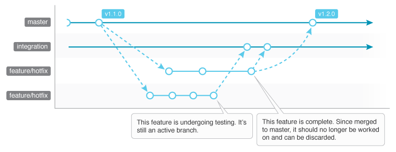

# Git Workflow

This workflow is tightly based on the "feature branch workflow" model and pragmatic Continuous Integration practices. It's written as an overview of principles and does not rely on specific CI tools or third party applications.

This document is useful to help teams align around a unified workflow for projects of all sizes. It assumes that you're already familiar with git.

## Git History

Your git history is there to help you. The goal is to not only have granular access to your revisions, but to have a clean and organized history of your work.

Use these tips to make your history as useful as possible:

- Use merge commits when it adds clarity; omit them when they don't.
  - If you don't need to mark in history the work you did on a temporary branch, consider using `git rebase` before merging to master.
- Keep your history ordered logically. A properly ordered history makes for better use.
  - If change X depends on change Y, commit X should come before Y.
- Commit early and often.
  - Bite-size commits are more easy to understand and revert if needed.
- Each commit should include a single  set of related changes.
  - Don't fix a bug, add a feature, and make irrelevant changes all in one commit (or branch even).
  - If needed, use `git add -p` to interactively stage sections from modified files.
- Don't split related changes into several commits.
  - e.g. code changes and corresponding unit tests should live in the same commit.
- Don't rewrite published history.
  - If your branch lives on remote, don't use history altering commands (i.e. `commit --amend`, `rebase`).

## Flow



1. Checkout feature/hotfix branch from master.
2. Work on feature/hotfix branch as needed.
3. Merge feature/hotfix branch to integration (for testing).
4. Once tests pass and feature/hotfix is green lit, merge it into master (using `no-ff`).
5. Once ready to release to production, tag master and deploy.

## Branches

### Master Branch

This branch represents production ready code and should always be deployable.

- This is a long lived branch.
- No broken or partially implemented code should live here.
- **All** feature branches should be checked out from here.
- **No** work should be done on this branch.
  - You shouldn't commit to master; only merge from a feature/hotfix branch.
- To keep your repository history informative and easy to review, I recommend you  use non fast-forward merge commits (`git merge --no-ff`) when incorporating feature/hotfix branches.
  - Since feature/hotfix branches are temporary (not long lived), using a [non fast-forward merge commit to master](#why-you-should-use-non-fast-forward-merge-commits-to-master) makes it easy to review history in order to find out when logic was put into production.
- Use annotated [tags](#tags) to mark release versions.

### Integration Branch

Commits to this branch are to be sent to a testing server (preferably with a CI tool automating it).

- This is a long lived branch.
- It represents testing/staging code.
  - It may contain partially implemented code (as it is used for integrating multiple branches and testing before green lighting a feature/hotfix).
  - **No** branches should be checked out from here.
  - **No** work should be done on this branch.
  - **Never** merge into master from here.
- If your team includes more than one developer, this branch is required.
  - It is used to avoid conflicts when testing against multiple feature/hotfix merges.

### Feature and Hotfix Branches

These branches are where work is done on a project (whether as a feature or hotfix).

- These are short lived branches.
- **Always** checkout your branches from master.
- Merge to the integration branch and await testing to pass before merging to master.
- Rebase only on local branches.
  - Don't rewrite history on remote branches.
- If you're working on a feature/hotfix for more than a day, consider pushing it to remote.
- If your branch is many commits apart from master, rebase.
- If you're working on a branch with a teammate, consider using `git pull --rebase`, so to not pollute your history with unneeded merge commits.

## Conventions

### Tags

- Annotated tags should be used to define releases.
  - Tags should be prefixed with the letter "v" and use Semantic Versioning ([see below](#semantic-versioning)).
    - e.g. `git tag -a v1.0.0 -m "1.0.0"`
- Besides master, no other branch *requires* tags.

#### Semantic Versioning

Version numbers are defined as MAJOR.MINOR.PATCH.

- MAJOR is bumped when you make incompatible API changes.
- MINOR is bumped when you add functionality that is backwards-compatible.
- PATCH is bumped when you make backwards-compatible bug fixes.

[Read more at semver.org](http://semver.org)

### Branch Naming

Your branches should either be feature or hotfix branches. Begin each feature branch with a "feat/" keyword and each hotfix branch with a "fix/" keyword. After the slash, define the feature/hotfix in a short and descriptive manner (using kebab-case instead of whitespace). If your feature/hotfix references a story/ticket in an agile board (i.e. Trello, JIRA), you can use that id instead of a description.

Examples:

- `feat/implement-auth-flow`
- `feat/RPO-7501`
- `fix/replace-bad-callback-args`
- `fix/ERS-432`

### Commit Messages

- The summary line (the first line of the message) should be descriptive and no longer than 50 characters.
  - It should be capitalized and written in present tense.
  - It shouldn't end with a period.
- After that should come a blank line followed by further explanation (as needed).
  - Lines should  wrap at 72 characters.
  - If the work is tied to a story/ticket in an agile board, include a link to it.
  - Feel free to use bullets instead of proper paragraphs.

## Clean Up

Remove outdated short term branches as needed (from local and remote). Ever so often, run maintenance tasks such as [git-gc](https://git-scm.com/docs/git-gc).

## Why You Should Use Non fast-forward Merge Commits to Master

Let's say a month into a project, you have to review a feature you added many weeks ago (feature SE-3485 in the below sample repo). At this point your feature branch is gone, so you need to look in master. If you used the `no-ff` flag when merging, you can easily find the commit in your history.

```
> project (master) $ git log --oneline

407b938 Refactor preamble
a2f3b35 Merge branch 'fix/CAF-86'
3bcf4aa Update token API
b43e905 Resolve token error
gx5p5r6 Merge branch 'feat/SE-3485'
5k427d2 Add init dispatcher
:
```
or
```
> project (master) $ git log --grep=feat/SE-3485

commit gx5p5r6e57018f7be9083f36b3b5f3c0f072e062
Merge:  d4b78b6 4ee2ee5
Author: Leandro Silva <address@email.com>
Date:   Thu Feb 16 12:51:45 2017 -0500

    Merge branch 'feat/SE-3485'

```

If you didn't force a merge commit with the `no-ff` flag (and a fast-forward merge occurred), you'll have to spend much more time to figure out which commits are related to your feature.

```
> project (master) $ git log --oneline

407b938 Refactor preamble
3bcf4aa Update token API
b43e905 Resolve token error
5k427d2 Add init dispatcher
:
```

The `no-ff` flag shouldn't necessarily be used for every merge, but should be for ones you want to mark a point in history for. I find it's valuable to mark in history the inclusion of most features and hotfixes.

## Improvements

If I missed an important detail or you want to propose a workflow improvement, feel free to message me or send over a PR.

## Further Reading

- https://www.atlassian.com/git/tutorials/comparing-workflows
- http://arjanvandergaag.nl/blog/clarify-git-history-with-merge-commits.html
- https://www.toptal.com/git/git-workflows-for-pros-a-good-git-guide
- https://www.youtube.com/watch?v=9SZ7kSQ2424
- https://www.atlassian.com/agile/branching
- https://medium.com/dev-managers-handbook/git-feature-flow-125d28dfef1e
- https://robots.thoughtbot.com/5-useful-tips-for-a-better-commit-message
- https://chris.beams.io/posts/git-commit/
- https://medium.com/@porteneuve/getting-solid-at-git-rebase-vs-merge-4fa1a48c53aa
- https://guides.github.com/introduction/flow
- https://github.com/agis/git-style-guide

***

## Notes on Continuous Integration

Here's a simplified rundown of how to setup a CI tool to align with this workflow:

- The master branch should trigger a build to PROD based on the **latest tagged commit**.
- The integration branch should trigger a build to TEST (or STAG) based on the **latest commit**.
- Feature/hotfix branches should not be tracked.

### Why Not Have the CI Tool Auto Build Off the HEAD of Master?

Since we have no gatekeeper for master (someone who is solely responsible for merging to master), we rely on each developer to merge their own branch once it passes testing on the integration branch. To prevent any issue that could be caused by someone accidentally committing to master — which shouldn't be done and could potentially introduce bugs to production code — we add the extra step of having to tag a version before any deployment takes place. In any case, version tagging should happen in order to properly mark releases. Note that while we can add hooks to mitigate this use case, this document aims to be a low level entry to creating a useful workflow (which is why CI tools and hooks are excluded).
